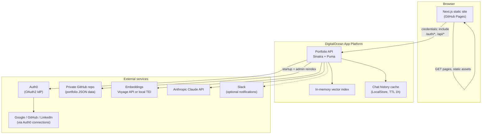
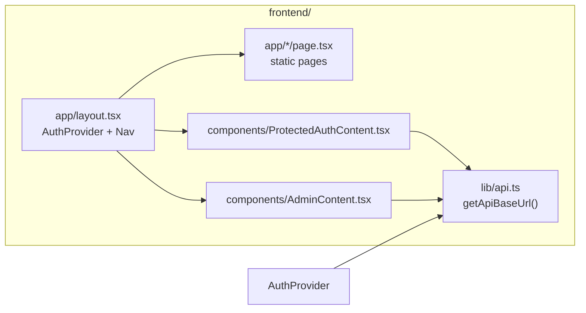
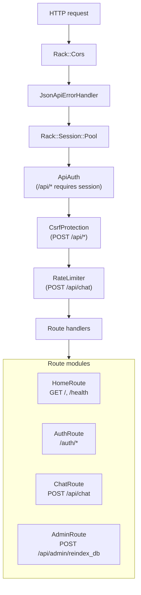
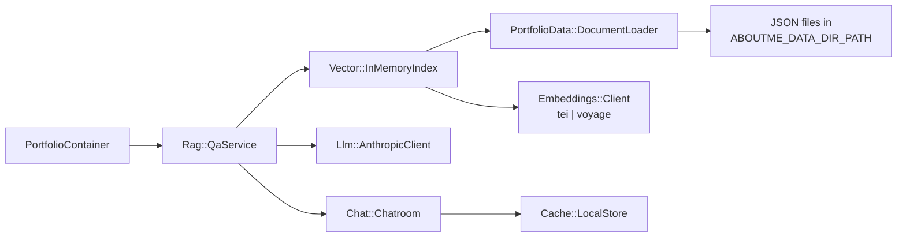
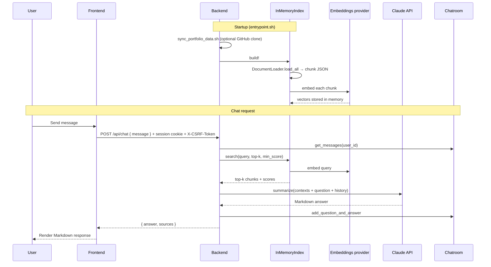
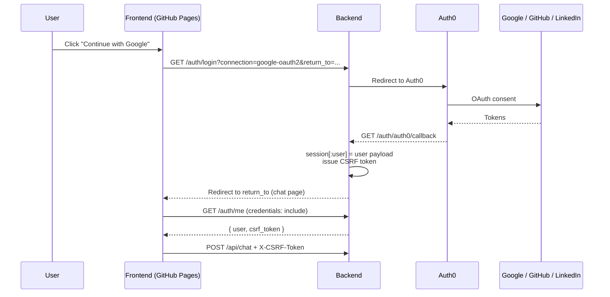
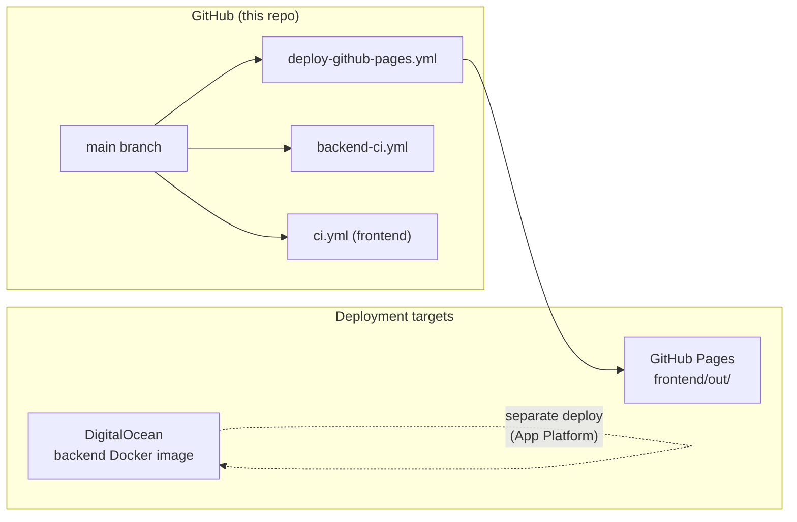

# Architecture

Portfolio site at [https://yunbo-lee.me/](https://yunbo-lee.me/) with a static Next.js frontend and a Ruby API backend that powers a RAG-based chat agent.

## System overview

The app is split into two deployable parts:

| Part | Stack | Hosting |
|------|-------|---------|
| **Frontend** | Next.js (static export) | GitHub Pages |
| **Backend** | Ruby + Sinatra (Rack/Puma) | DigitalOcean App Platform |

The frontend serves portfolio pages (home, career, personal) and a protected **Chat with my agent** feature. The backend handles OAuth sessions, rate limiting, retrieval-augmented generation (RAG), and admin operations.



## Frontend

The frontend lives in `frontend/` and uses the Next.js App Router with **`output: "export"`** so it builds to static HTML/JS in `frontend/out/`.

### Pages

| Route | Purpose |
|-------|---------|
| `/` | Home |
| `/career/` | Work history |
| `/personal/` | Personal background |
| `/chat/` | Protected chat UI (`ProtectedAuthContent`) |
| `/admin/` | Admin-only reindex trigger (`AdminContent`) |

### Key components

- **`AuthProvider`** — On load, calls `GET /auth/me` on the backend (with cookies) to determine session state and obtain a CSRF token.
- **`ProtectedAuthContent`** — Login buttons redirect to backend OAuth routes; chat messages are sent to `POST /api/chat`.
- **`Nav`** — Site navigation; reflects auth state via `localStorage` flag.

The API origin is configured at build time via `NEXT_PUBLIC_API_URL`.



## Backend

The backend lives in `backend/` and is a Rack application (`config.ru` → `PortfolioApi`).

### Request pipeline

Incoming requests pass through middleware before reaching route handlers:



### API endpoints

| Method | Path | Auth | Description |
|--------|------|------|-------------|
| `GET` | `/` | — | API root |
| `GET` | `/health` | — | Health check |
| `GET` | `/auth/login` | — | Start OAuth or guest login |
| `GET` | `/auth/auth0/callback` | — | Auth0 OAuth callback |
| `GET` | `/auth/logout` | session | Clear session / Auth0 logout |
| `GET` | `/auth/me` | session | Current user + CSRF token |
| `POST` | `/api/chat` | session + CSRF | Ask the portfolio agent |
| `POST` | `/api/admin/reindex_db` | admin session + CSRF | Sync data + rebuild index |

CORS allows the frontend origin with `credentials: true` so session cookies work cross-origin.

### Dependency container

At boot, `App::PortfolioContainer.build` wires the RAG stack:



## RAG pipeline

Portfolio knowledge is stored as JSON documents (work history, personal info, etc.). At startup the backend loads, chunks, embeds, and indexes them in memory — no external vector database.



### Document loading

1. Read all `*.json` files under `ABOUTME_DATA_DIR_PATH`.
2. Each file has a `collection_name` and `documents` array.
3. Document `contents` strings are joined and split into overlapping character chunks (`RAG_CHUNK_SIZE_CHARS`, `RAG_CHUNK_OVERLAP_PERCENT`).
4. Metadata (organization, category, period, tags) is included in the embedding text to improve retrieval.

### Retrieval + synthesis

1. Embed the user question (`input_type: "query"`).
2. Rank chunks by cosine similarity; filter by `RAG_MIN_SCORE`; take top `RAG_K`.
3. Pass retrieved snippets + conversation history to Claude with a detailed system prompt (grounding rules, STAR format, Markdown output).
4. Return the answer and source metadata.

Search events are published on the internal event bus for optional Slack analytics.

## Authentication

Auth uses **server-side sessions** (Rack session cookie) with **Auth0** as the OAuth2 broker. Social logins (Google, GitHub, LinkedIn) are Auth0 connections. A **guest** login path assigns an anonymous user ID derived from client IP for local/demo use.



Protected API routes require:

1. Valid session with `user_id`.
2. CSRF token (from `/auth/me`) on mutating requests.
3. Rate limit headroom (for `/api/chat`).

Admin routes additionally require the `admin` role in the session user payload.

## Data sync

Portfolio JSON is kept in a **separate private GitHub repository**. On container startup (`entrypoint.sh`), `script/sync_portfolio_data.sh` clones that repo using a GitHub personal access token and copies `data/` into `ABOUTME_DATA_DIR_PATH`.

For local development, bundled example data lives in `backend/external_example/data/`.

Admins can trigger a live reindex from the `/admin/` page, which calls `POST /api/admin/reindex_db`:

1. Re-run the GitHub data sync.
2. Rebuild the in-memory vector index (`qa.reindex_db`).

## Embeddings providers

| Provider | Config | Use case |
|----------|--------|----------|
| **tei** | `EMBEDDING_PROVIDER=tei`, local HuggingFace TEI container | Local dev via `docker-compose.yml` |
| **voyage** | `EMBEDDING_PROVIDER=voyage`, `VOYAGE_API_KEY` | Production (no local embeddings container) |

## Observability

An in-process **`Events::EventBus`** publishes domain events. When Slack is configured, `Notifier::SlackListener` sends messages for:

- `auth.login` — someone signed in
- `rag.search` — query + top retrieval results
- `llm.error` — Claude API failures

## Deployment & CI



| Workflow | Trigger | Action |
|----------|---------|--------|
| `deploy-github-pages.yml` | Push to `main` | Build Next.js static export → deploy to GitHub Pages |
| `backend-ci.yml` | Push / PR | RuboCop + Rake tests |
| `ci.yml` | Push / PR | Frontend lint + Vitest |

### Local development

```bash
# Terminal 1 — backend (Docker, includes TEI embeddings)
cd backend && docker compose up --build
# API at http://localhost:3001

# Terminal 2 — frontend
cd frontend && npm install && npm run dev
# Site at http://localhost:3000
```

Set `NEXT_PUBLIC_API_URL=http://localhost:3001` in `frontend/.env` and configure `backend/.env` from `.env.example`.

## Repository layout

```
yblee85.github.io/
├── frontend/          # Next.js static site
│   ├── app/           # App Router pages
│   ├── components/    # UI, auth, chat, admin
│   └── lib/           # API helpers
├── backend/           # Ruby Sinatra API
│   ├── src/
│   │   ├── app/           # DI container
│   │   ├── lib/           # Config, embeddings, LLM, cache, events
│   │   ├── middleware/    # Auth, CSRF, rate limit, errors
│   │   └── service/       # Routes, RAG, auth, vector index, CLI
│   ├── script/        # Data sync shell script
│   └── docker-compose.yml
└── .github/workflows/ # CI/CD
```

## Design notes

- **No vector DB** — simplicity for a single-tenant portfolio; the full index fits in memory.
- **Static frontend + cookie auth** — GitHub Pages cannot run a Node server, so auth and chat logic live entirely on the backend with CORS + credentials.
- **Private data repo** — portfolio JSON stays out of the public site repo; the backend pulls it at runtime with a PAT.
- **Guest login** — lowers friction for demos while OAuth users get identifiable rate-limit keys.
